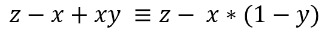

###Genetic algorithm of finding the maximum value of a function
---

University project by commonPlaceC & CpedniyNikon

Finding the local maximum of a functions:

-  with maximum 250 for x ∈ [0; 500)
-  with maximum 9900 in x ∈ [0; 100)